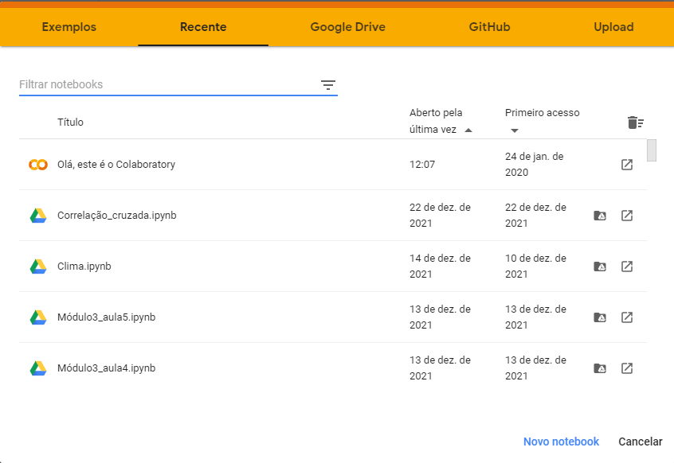
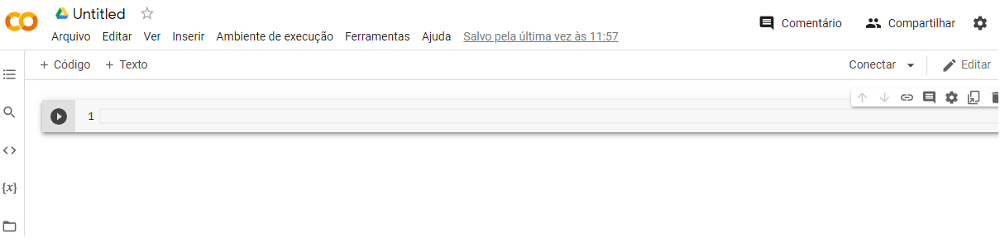
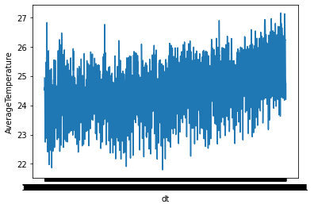

Capítulo 1
# Pré-processamento de séries temporais


Você já deve ter ouvido falar que alguém ganhou dinheiro na bolsa de valores vendendo uma ação que havia sido comprada por um valor mais baixo em uma data anterior. Outra possibilidade é que você tenha ouvido falar que o número de vendas de um produto tem potencial de crescimento futuro ou que o número de casos de uma determinada doença sofreu pouca alteração de acordo com sua média móvel.
Todos esses tópicos têm relação e podem ser analisados levando em consideração que estamos lidando com séries temporais. Neste capítulo iremos apresentar o que são as séries temporais e como podemos realizar as primeiras análises sobre elas com ferramentas de ciência de dados. 

## 1.1 O que são séries temporais?

Séries temporais são dados de uma certa quantidade que varia no decorrer do tempo. Normalmente esses dados são coletados em intervalos iguais, como por exemplo, uma vez ao dia ou uma vez a cada segundo. 

## 1.2 Análise preliminar de dados

Para que possamos assimilar os conceitos relacionados às séries temporais, sem a necessidade de abstrações, nesse livro iremos desenvolver um projeto prático. 
Para que você não tenha que perder tempo com a instalação de bibliotecas iremos utilizar o [Google Colab](https://colab.research.google.com/) que já possui a linguagem Python e todas as bibliotecas necessárias para os projetos que iremos desenvolver. Ao abrir o Colab você irá se deparar com uma tela como esta:



Figura 1.1: Exemplo de tela inicial quando abrimos a página do Google Colab.

	Nesta tela são mostrados os arquivos mais recentes ou de exemplo para que possamos trabalhar no Colab. Chamamos os arquivos com extensão .ipynb de notebooks. Nossa intenção é criar um projeto do zero, por isso você deve clicar na opção que aparece no canto inferior direito **Novo notebook**. Quando essa operação é executada é criado um novo notebook em branco como mostrado na Figura 1.2. 


Figura 1.2: Exemplo de notebook em branco. 

	Nesse notebook você pode clicar no canto superior esquerdo em Untitled para dar um novo nome ao notebook. Nós iremos nomear esse notebook como Mudanças climáticas. Esse nome já nos dá uma dica do problema que iremos tratar. Vamos abrir uma base de dados relacionada ao assunto de mudanças climáticas utilizando o Colab. Essa base de dados está disponível no Kaggle neste link [https://www.kaggle.com/berkeleyearth/climate-change-earth-surface-temperature-data](https://www.kaggle.com/berkeleyearth/climate-change-earth-surface-temperature-data) e é proveniente de um estudo da Berkeley Earth, que combina 1,6 bilhões de relatórios de temperatura de 16 arquivos pré-existentes. A Berkeley Earth é uma organização sem fins lucrativos independente, sediada em Berkeley, Califórnia, focada na análise de dados de temperatura do solo para a ciência climática. Dos dados disponibilizados nessa página, nós selecionamos a parcela relacionada à temperatura média global do solo por país. Essa parte dos dados está disponível também no repositório do github relacionado a este livro no link [https://github.com/alura-tech/pos-datascience-time-series-forecasting/raw/main/GlobalLandTemperaturesByCountry.csv
](https://github.com/alura-tech/pos-datascience-time-series-forecasting/raw/main/GlobalLandTemperaturesByCountry.csv
).

	Voltando para o Colab na primeira célula logo abaixo de **+Código** e **+Texto** podemos digitar código em Python. Para que possamos ler o conjunto de dados copie o endereço da base no Github e cole nessa primeira célula. Você deve utilizar aspas para delimitar o endereço. Além disso, iremos colocar esse endereço em uma variável de nome `url` ficando com o seguinte resultado:

```
url='https://github.com/alura-tech/pos-datascience-time-series-forecasting/raw/main/GlobalLandTemperaturesByCountry.csv'
```
	Para rodar essa célula de código basta utilizar o comando `shift+enter`no teclado. Após a execução da célula de código se houver uma saída o Colab irá exibi-lá logo abaixo e também irá criar uma célula de código nova célula de código. 
	A leitura do arquivo csv que disponibilizamos na url através de um repositório do Github pode ser realizada com a biblioteca Pandas. Para isso podemos realizar a importação dessa biblioteca e em seguida utilizar o comando read_csv.

```
import pandas as pd
dados = pd.read_csv(url)
```
	Nas linhas de código acima realizamos a importação dando o apelido de pd para a biblioteca pandas. Em seguida realizamos a leitura do arquivo colocando o resultado na variável de nome `dado`. A variável dado contém agora o que chamamos de DataFrame. Para visualizar as cinco primeiras linhas desse DataFrame podemos utilizar o seguinte comando:
```
dados.head()
```
Como resultado obtivemos uma tabela com cinco colunas e cinco linhas. A primeira coluna não tem nome pois se trata de um índice que indica o número de cada linha. A partir daí temos as seguintes colunas:

dt: ano, dia e mês - Os primeiros dados são de 1743;
AverageTemperature: temperatura média global do solo em graus celsius;
AverageTemperatureUncertainty: incerteza dos valores de temperatura coletados;
Country: país.

Tabela 1: Primeiras linhas da base de dados de temperatura média do solo por país.
|   |  dt |   Average Temperature | AverageTemperatureUncertainty  | Country  |
|---|---|---|---|---|
|  0 | 1743-11-01  | 4.384  | 2.294  | Åland |
|   1| 1743-12-01  | NaN  | NaN  | Åland  |
|   2| 1744-01-01  | NaN  | NaN  | Åland   |
|   3| 1744-02-01  | NaN  | NaN  | Åland   |
|   4| 1744-03-01  | NaN  | NaN  | Åland   |
 
	Aqui já podemos observar que as temperaturas começaram a ser coletadas em 1743. Para verificar a maior data presente no DataFrame podemos digitar:
```
dados[‘dt’].max()
```
	Como saída você deve ter obtido a data de `2013-09-01`. Isso significa que temos em torno de 270 anos de valores de temperatura coletados no decorrer do tempo. Essa é uma quantidade grande de informações que foi coletada para cada um dos países. Que tal nos concentrarmos no Brasil como nosso exemplo de estudo? Para fazer isso vamos digite:
 
```
dados_br = dados.query('Country == "Brazil"')
```
	Fazendo isso estamos colocando na variável `dados_br` os dados que na coluna `Country` possuem o valor `Brazil`. Mas além disso, você deve ter reparado que nas primeiras linhas da Tabela 1 nós temos diversos valores `NaN`, ou seja, valores nulos. Diversos algoritmos utilizados em na análise de dados e na previsão de séries temporais podem ter problemas com dados nulos. Por isso, precisamos lidar com eles antes de iniciar o trabalho. Será que ainda restam valores nulos no conjunto de dados do Brasil? 
	Para verificar isso podemos escrever:
```
dados_nulos= dados_br.isnull().sum()
dados_nulos
```
	O método .isnull() verifica se o valor dentro de uma linha é nulo e retorna `True` (Verdadeiro) caso ele seja.  Como o `True` é equivalente ao número um e o False ao número zero quando utilizamos o `.sum` conseguimos somar todos os valores e obter o número total de valores nulos. A saída neste caso é:
 
```
dt                                0
AverageTemperature               17
AverageTemperatureUncertainty    17
Country                           0
dtype: int64
```
	
	Isso significa que temos 17 linhas com valores `Nan` nas colunas `AverageTemperature` e `AverageTemperatureUncertainty`. 
	Existem diversas formas de tratamento de valores nulos, mas para o nosso objetivo de análise inicial basta efetuar a remoção destes dados. 
```
dados_br.dropna(inplace=True)
```
	Com isso, eliminamos os valores nulos. O `inplace=True` nos permitiu realizar essa operação diretamente no `dados_br` sem ter que criar outra variável. Agora temos um conjunto de dados sem valores nulos e podemos começar a pensar no objetivo deste livro que é realizar previsões de valores para datas futuras. Para que isso seja possível, vamos tentar entender um pouco mais sobre nossos dados. 
 
```
dados_br['AverageTemperature'].describe()
```
A saída da linha de código é: 
```
count    2164.000000
mean       24.699256
std         0.978787
min        21.797000
25%        24.022500
50%        24.829500
75%        25.449750
max        27.151000
Name: AverageTemperature, dtype: float64
```
Temos as seguintes informações:
o count, que é o número de linhas (2164)
mean é a média (24.7 graus)
std é o desvio-padrão (0.98)
min é a temperatura mínima (21.8 graus)
25%, 50% e 75% são os quartis. 
max é a temperatura máxima (27.1 graus)
 
	Essas informações são bastante úteis quando se trata de uma previsão. Nós conseguimos, por exemplo, ver que a média de temperatura no decorrer dos anos estudados foi de aproximadamente 24,70 °C. Se quisermos “chutar” o valor da temperatura média do dia de amanhã esse valor de média seria uma boa aposta. Ou se ontem foi um dia frio, podemos supor que a temperatura de amanhã estará mais próxima da temperatura mínima observada em todo o período estudado, mas ao mesmo tempo seria pouco provável que tenhamos um valor fora do intervalo de temperaturas mínima e máxima. Em todos esses casos estamos lidando com informações que obtivemos dos dados do passado para inferir um valor para uma data futura. De certa forma é isso que o método de previsão em séries temporais faz. Uma que nós mesmo podemos fazer esse processo é visualizando nossos dados através de um gráfico.
 
## 1.3 Visualização de dados

	Vamos começar tentando visualizar os dados presentes na coluna `AverageTemperature`. Para isso vamos importar a biblioteca Seaborn:
```
import seaborn as sns
```
	Com essa biblioteca podemos gerar um gráfico de linhas. É através de gráficos de linha que normalmente os dados de séries temporais são expressados. 
```
sns.lineplot(x='dt', y='AverageTemperature', data=dados_br)

```

Figura 1.3: Série temporal da Temperatura média pelas datas. 


	No eixo y da figura gerada estamos mostrando a Temperatura média e no eixo x estamos tentando mostrar as datas. Porém, no caso das datas tivemos um problema. As datas ficaram todas encavaladas no gráfico. Isso ocorre porque a Seaborn não “entendeu” que estamos trabalhando com datas e interpretou a informação de maneira incorreta na hora de gerar o gráfico. 
